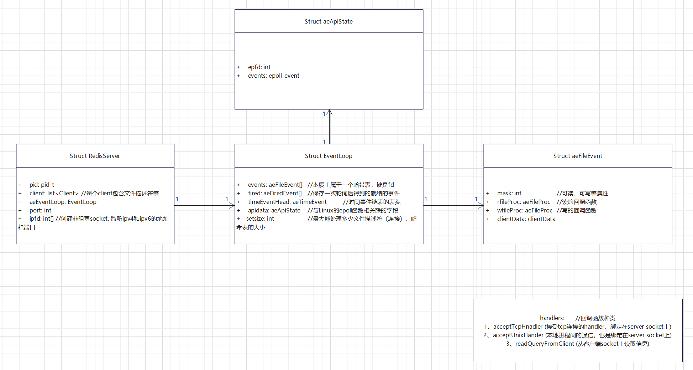
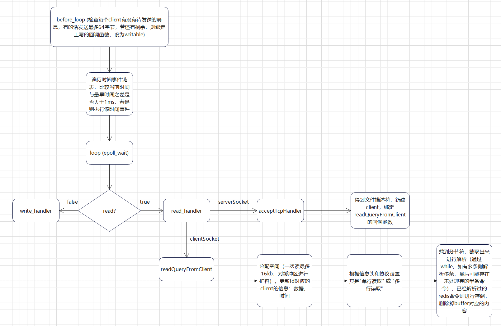

# redis-code-read
redis代码精读1——基础架构和网络模型

redis全称为Remote Dictionary Server，即"远程字典服务"，是一个基于BSD
licensed开源协议、C99标准、依赖于glibc的C语言程序，提供高性能的内存存储服务，并同时提供了数据持久化和分布式、集群化的解决方案；是互联网架构存储系统中最为广泛使用的中间件之一。

本系列博客通过文字、流程图、类图、示意图等方式对redis进行讲解，未来可能进行通过伪代码、C++、Java等语言对redis进行重构的工作以提供更佳清晰的redis学习指导；该系列的博客预计分为三个篇章：1、基础架构与网络模型；2、数据结构与算法；3、分布式与集群设计。以下是第一章：基础架构与网络模型。

redis采用glibc的epoll系列网络编程函数进行网络开发；其特点是事件驱动、多路复用：将每一个客户端连接的"连接的建立"与"信息的传输"进行解耦，使用一个reactor线程便可以处理多个连接的建立请求和信息传输请求；对于互联网服务而言，网络IO和磁盘IO往往是性能瓶颈，所以redis中使用单线程多路复用模型进行编程并不会对互联网的服务造成明显阻塞，与此同时，使用单线程模型使软件架构得到极大简化，其无并发冲突的特点更是使其成为分布式锁的最方便的实现手段。

redis的核心结构体是RedisServer，里面包含了pid（进程id）、客户端结构体链表（包括文件描述符、缓冲区、未执行的命令）、aeEventLoop（一个开源的网络编程框架，可理解为对epoll的简单包装）、端口和服务端的套接字等等字段。由于本章重点在于网络模型，所以略过数据存储结构和集群的部分。在主函数中，最终会调用aeMain函数，即开始进行事件循环的监听，充分利用aeEventLoop变量。

aeEventLoop是一个网络框架，其主要的结构体EventLoop里面的重点字段有：events（本质上属于一个哈希表，键是fd）、fired（保存一次轮询后得到的就绪的事件）、timeEventHead（时间事件链表的表头）、apidata（与Linux的epoll函数相关联的字段）、setsize（最大能处理多少文件描述符（连接），哈希表的大小）。其核心运行步骤为：

1.  在轮询网络读写（文件）事件、时间事件的开头，会调用before_loop函数，检查每个client有没有待发送的消息，有的话发送最多64字节，若还有剩余，则绑定上写的回调函数，设为writable。

2.  遍历时间事件链表，比较当前时间与最早时间之差是否大于1ms，若是则执行该时间事件。该模块采用遍历链表的方式实现，复杂度为O(N)；虽有优化空间，但作者认为该缺陷不至于影响redis的核心性能。

3.  根据epoll_wait得到事件列表，对于每一个事件(event)，判断其是否可读？可写？分别调用其读的回调函数和写的回调函数。

aeEventLoop中的events中，每一个event都会绑定一个事件的回调函数，取决于该套接字是server还是client、可读还是可写，绑定不同的回调函数：rfileProc（读的回调函数）、wfileProc（写的回调函数）。rfileProc和wfileProc是aeFileEvent的回调函数的类型，须传入具体的回调函数，而具体的读和写的回调函数有：

1、acceptTcpHnadler (接受tcp连接的handler，绑定在server socket上)

2、acceptUnixHander (本地进程间的通信，也是绑定在server socket上)

3.  readQueryFromClient (从客户端socket上读取信息)

对于server的套接字而言，acceptTcpHnadler需要处理新的连接；对于client的套接字而言，readQueryFromClient需要

1\.
分配空间（一次读最多16kb，对缓冲区进行扩容），更新fd对应的client的信息：数据、时间；

2\. 根据信息头和协议设置其是\"单行读取\" 或 \"多行读取\"；

3\.
找到分节符，截取出来进行解析（通过while，如有多条则解析多条，最后可能存在未处理完的半条命令），已经解析过的redis命令则进行存储，删除掉buffer对应的内容。
